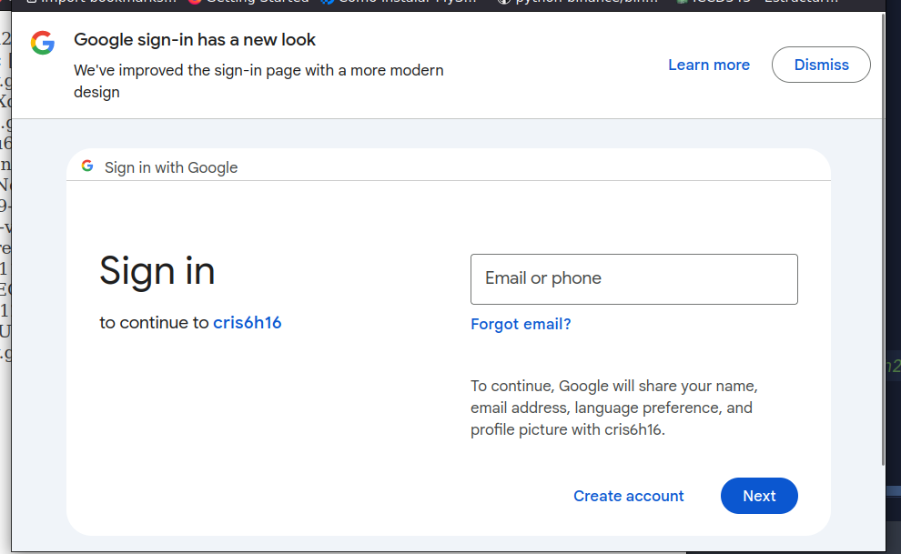
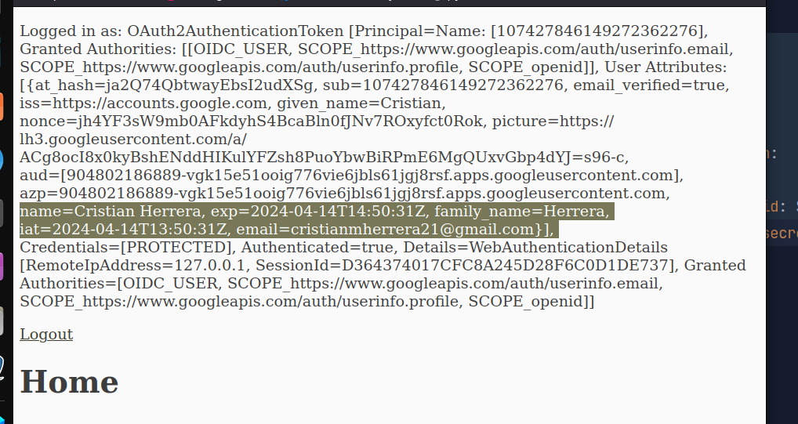

1. go to `localhost:8080/` --> `isAuthenticated()`


2. redirected to `http://localhost:8080/login/oauth2/code/<hello-word>`

  

3. logged in successfully  

  


## Configured  

if `provider` == `RegistrationId` then isn't necessary to specify `provider`  
```yaml
spring:
  security:
    oauth2:
      client:
        registration:
          google:
            client-id: ${GOOGLE_CLIENT_ID}
            client-secret: ${GOOGLE_CLIENT_SECRET}
```
if `isAuthenticated() == false` in `/` then:
- redirect_uri=_http://localhost:8080/login/oauth2/code/google_  

###

Specifying `provider` (work like the above)  
```yaml
spring:
  security:
    oauth2:
      client:
        registration:
          hello-world:
            provider: google
            client-id: ${GOOGLE_CLIENT_ID}
            client-secret: ${GOOGLE_CLIENT_SECRET}
```
if `isAuthenticated() == false` in `/` then:
- redirect_uri=_http://localhost:8080/login/oauth2/code/hello-word_
#
## Additional
### Provider Allows multiple configuration
_Providers that support multi-tenancy, which results in different protocol endpoints for each tenant (or sub-domain).
For example, an OAuth Client registered with Okta is assigned to a specific sub-domain and have their own protocol endpoints._
```yaml
spring:
  security:
    oauth2:
      client:
        registration:
          okta:
            client-id: okta-client-id
            client-secret: okta-client-secret
        provider:
          okta:	
            authorization-uri: https://your-subdomain.oktapreview.com/oauth2/v1/authorize
            token-uri: https://your-subdomain.oktapreview.com/oauth2/v1/token
            user-info-uri: https://your-subdomain.oktapreview.com/oauth2/v1/userinfo
            user-name-attribute: sub
            jwk-set-uri: https://your-subdomain.oktapreview.com/oauth2/v1/keys
```

### Modify Entirely the OAuth2 Configuration
```java
@Configuration
public class OAuth2LoginConfig {

	@Bean
	public SecurityFilterChain filterChain(HttpSecurity http) throws Exception {
		http
			.authorizeHttpRequests(authorize -> authorize
				.anyRequest().authenticated()
			)
			.oauth2Login(withDefaults()); // sets up the default OAuth2 login flow with Spring Security.
		return http.build();
	}

	@Bean
	public ClientRegistrationRepository clientRegistrationRepository() {
		return new InMemoryClientRegistrationRepository(this.googleClientRegistration());//stores client registrations in memory
	}

	private ClientRegistration googleClientRegistration() {
		return ClientRegistration.withRegistrationId("google") // Object represents the details of how your application interacts with Google's OAuth2 provider. 
			.clientId("google-client-id")
			.clientSecret("google-client-secret")
			.clientAuthenticationMethod(ClientAuthenticationMethod.CLIENT_SECRET_BASIC)
			.authorizationGrantType(AuthorizationGrantType.AUTHORIZATION_CODE)
			.redirectUri("{baseUrl}/login/oauth2/code/{registrationId}")
			.scope("openid", "profile", "email", "address", "phone")
			.authorizationUri("https://accounts.google.com/o/oauth2/v2/auth")
			.tokenUri("https://www.googleapis.com/oauth2/v4/token")
			.userInfoUri("https://www.googleapis.com/oauth2/v3/userinfo")
			.userNameAttributeName(IdTokenClaimNames.SUB)
			.jwkSetUri("https://www.googleapis.com/oauth2/v3/certs")
			.clientName("Google")
			.build();
	}
}
```
#
## Customizing the `GrantedAuthoritiesMapper`
### **my authorities were**:  
`[`
- `OIDC_USER`,
- `SCOPE_https://www.googleapis.com/auth/userinfo.email`,
- `SCOPE_https://www.googleapis.com/auth/userinfo.profile`,
- `SCOPE_openid`  

`]`  
_authorities absolutely can vary it depends on the Auth Scopes assigned in the Provider_

### **after customized it**:  
`[`  

- `ROLE_USER`  

`]`    

_Depends on database stored by now it wasn't implemented_


see more at [docs](https://docs.spring.io/spring-security/reference/servlet/oauth2/login/advanced.html)